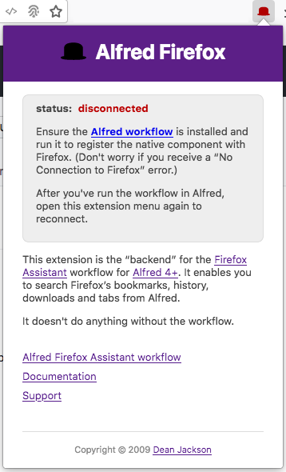

Setup
=====

Unfortunately, this workflow requires a relatively complex setup :(

Due to Firefox's preposterous lack of support for AppleScript, it's not possible for external programs to directly interact with Firefox in any non-trivial way.

As a result, in addition to the workflow, you must also install the corresponding [browser extension][addon] which enables communication between Firefox and the workflow.

Setup is *slightly* easier if you install (and run) [the workflow][workflow] first, and then the [browser extension][addon].

Installation
------------

1. Download and install the workflow from [GitHub][workflow]
2. Download and install the Firefox extension from [blah][addon]

Setup
-----

When you first run the workflow, it will install the native-application manifest that tells Firefox where to find the workflow. Without this, the Firefox extension won't work. At this point, you'll probaby see the following error, but this is expected:

The workflow has installed the native-application manifest, and will connect to Firefox as soon as the extension is installed. Once you've installed the extension, you should see the following when you click on its icon:

If you've installed the browser extension before you've run the workflow, you'll see the following error because Firefox doesn't know where to find the workflow:

Now you need to install the workflow, run it, and then click on the extension's icon again to cause it to try to reconnect to the native application. After a second or so, the extension should indicate that it's connected to the workflow:

At this point, you should be able to search Firefox's bookmarks, history, downloads and tabs from Alfred.

### Don't forget!

1. You should set a Hotkey for the "Current Tab Actions" Script Filter to get quick access to actions for the active tab.

  

2. You have to allow the workflow to run in private windows to use the "Open in Incognito Window" action. To do this, go to `about:addons` and click the workflow's "Manage" button. Then select "Run in Private Windows: Allow".

  

---

[^ Documentation index](index.md).

[workflow]: https://github.com/deanishe/alfred-firefox/releases/latest
[addon]: https://addons.mozilla.org/en-US/firefox/addon/alfred-launcher-integration/
